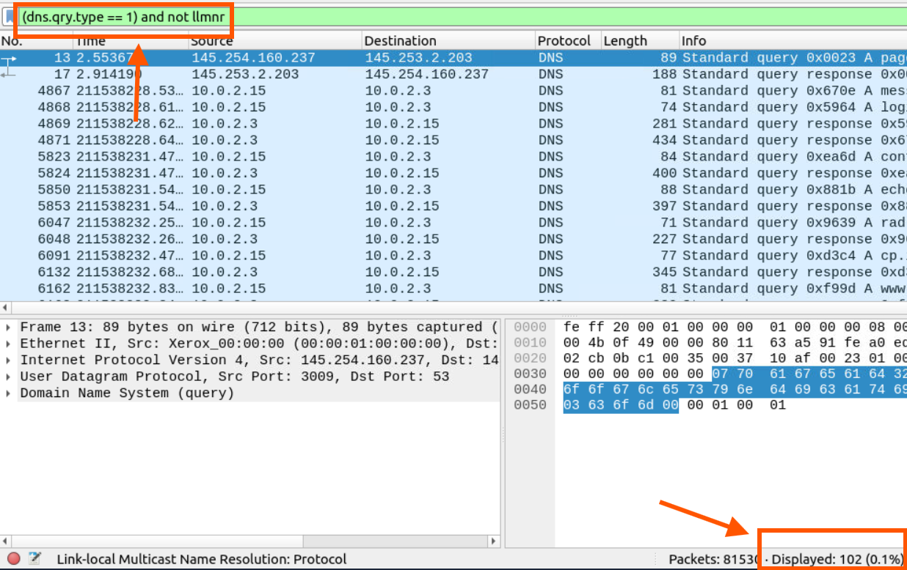
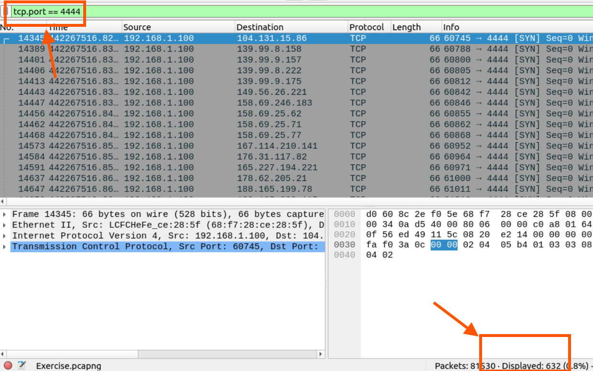
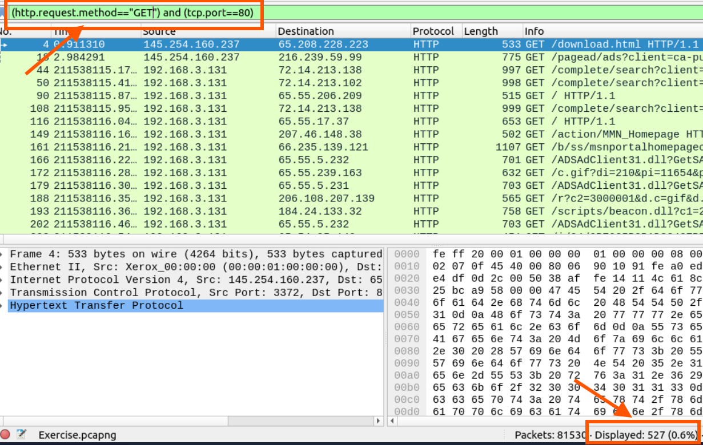
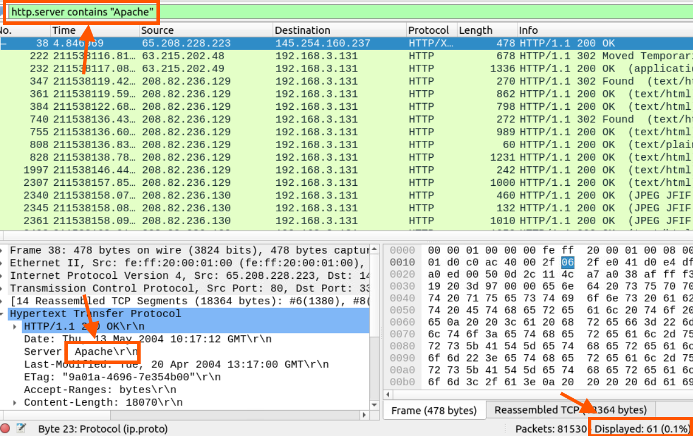
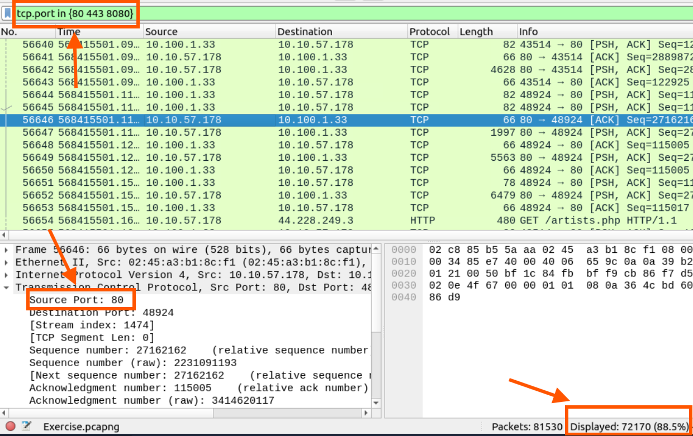
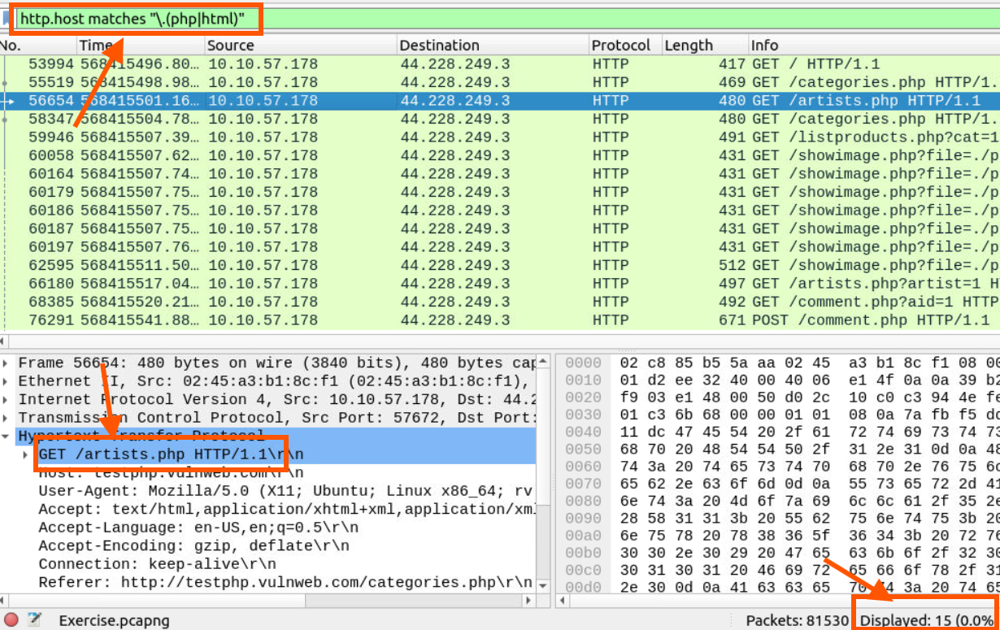
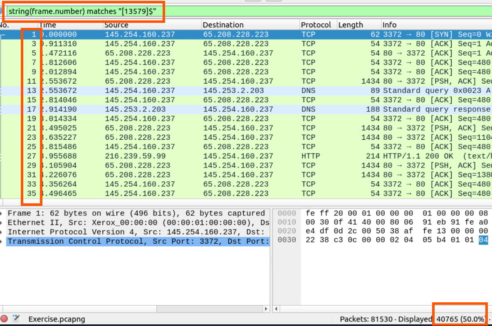

# Análisis de tráfico mediante filtros avanzados de Wireshark

## Objetivo

En esta etapa se trabajó con los filtros de visualización de Wireshark, comenzando por expresiones simples y avanzando hacia filtros más específicos y combinados.

El objetivo principal fue aprender a reducir grandes cantidades de tráfico hasta obtener únicamente los paquetes relevantes para una investigación determinada.

---

# Importancia para un entorno SOC

El conocimiento de filtros de Wireshark resulta especialmente importante en tareas de análisis y respuesta ante incidentes.

Un analista puede recibir una captura de tráfico y necesitar determinar rápidamente:

- Qué equipo inició una comunicación.
- Con qué dirección IP se comunicó.
- Qué puertos fueron utilizados.
- Qué protocolos participaron.
- Qué solicitudes HTTP fueron realizadas.
- Qué consultas DNS se generaron.
- Si existe tráfico fuera de lo esperado.
- Qué paquetes contienen determinada información.
- Qué comunicaciones deben investigarse con mayor profundidad.

Los filtros permiten realizar esta primera etapa de clasificación y reducir el ruido antes de continuar con un análisis más detallado.

# Evidencia

Las capturas incluidas en esta sección muestran los diferentes filtros utilizados durante los ejercicios prácticos.

## Filtrar DNS-consultas-tipo-A
 

## Filtrar-paquetes con TTL-10

## Filtrar-paquetes-que-utilizan-Puerto-TCP-4444

## Filtrar-Solicitudes-GET-al puerto-80

## Filtro-CONTAINS-paquetes-HTTP-con-servidor-Apache

## Filtro-IN-paquetes-con-puerto-80,443,8080

## Filtro-MATCHES-paquetes-donde-el-Host-coincida-con-htm-l-php

## Filtro-STRING-muestra-solo-Frames-impares

Estas capturas documentan no solamente el resultado final, sino también las herramientas utilizadas para llegar a él.
