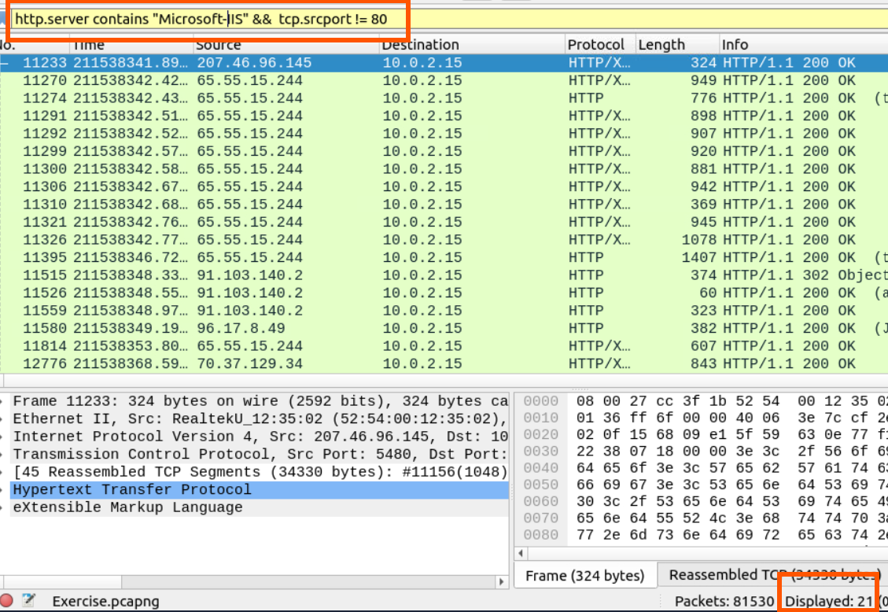
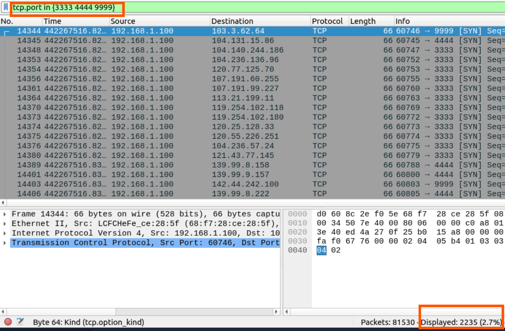
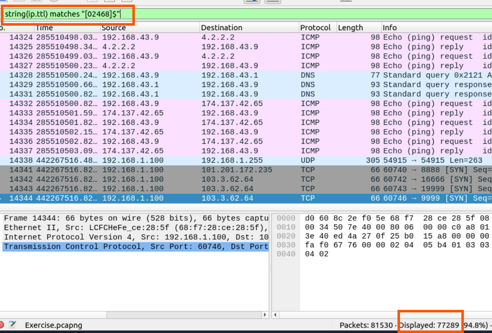
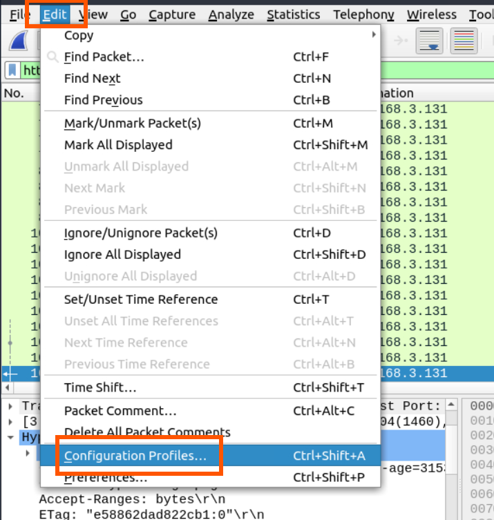
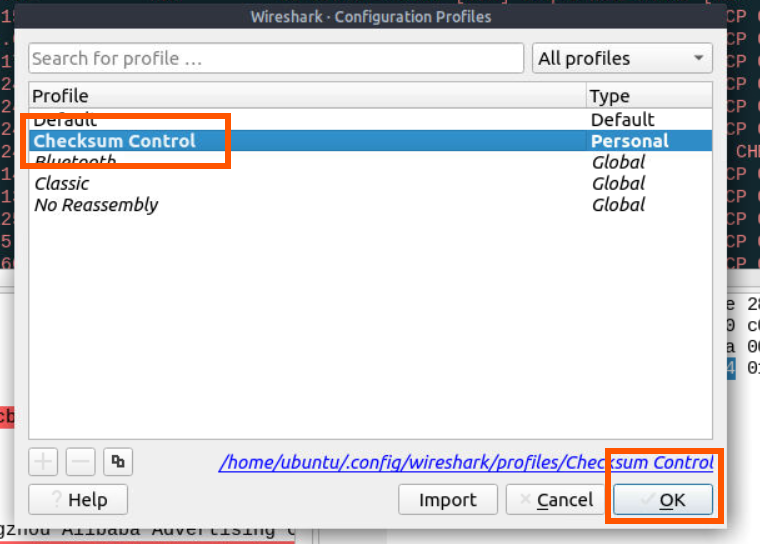
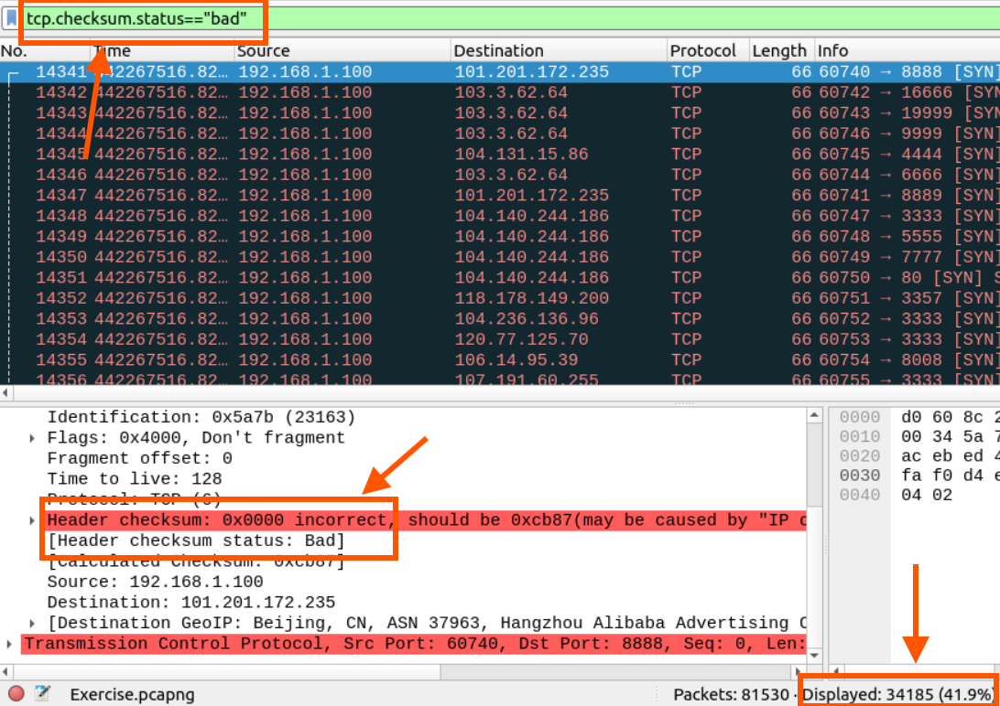

# Análisis de tráfico mediante filtros de Wireshark

## Objetivo

En esta etapa se trabajó con los filtros de visualización de Wireshark, comenzando por expresiones simples y avanzando hacia filtros más específicos y combinados.

El objetivo principal fue aprender a reducir grandes cantidades de tráfico hasta obtener únicamente los paquetes relevantes para una investigación determinada.


---


# Importancia para un entorno SOC

El conocimiento de filtros de Wireshark resulta especialmente importante en tareas de análisis y respuesta ante incidentes.

Un analista puede recibir una captura de tráfico y necesitar determinar rápidamente:

- Qué equipo inició una comunicación.
- Con qué dirección IP se comunicó.
- Qué puertos fueron utilizados.
- Qué protocolos participaron.
- Qué solicitudes HTTP fueron realizadas.
- Qué consultas DNS se generaron.
- Si existe tráfico fuera de lo esperado.
- Qué paquetes contienen determinada información.
- Qué comunicaciones deben investigarse con mayor profundidad.

Los filtros permiten realizar esta primera etapa de clasificación y reducir el ruido antes de continuar con un análisis más detallado.


# Evidencia

Las capturas incluidas en esta sección muestran los diferentes filtros utilizados durante los ejercicios prácticos.


- Filtros simples.
- Filtros combinados.
- Operadores `AND`, `OR` y `NOT`.
- Comparaciones de valores.
- Búsquedas mediante `contains`.
- Búsquedas mediante `matches`.
- Uso del operador `in`.
- Uso de `upper` y `lower`.
- Conversión mediante `string`.
- Exclusión de tráfico no relevante.
- Refinamiento progresivo de consultas.


## Ejercicios


**Pregunta 1:** Encuentra todos los servidores Microsoft IIS. ¿Cuál es el número de paquetes que no se originaron desde el "puerto 80"?

En primer lugar, podemos desglosar la pregunta en dos partes. La primera hace referencia a **Encontrar servidores con nombre MICROSOFTIIS**, Para ello, utilizamos el filtro `http.server contains "Microsoft-IIS"`, que permite localizar los paquetes cuyo campo de servidor HTTP contiene esa cadena. y debemos excluir los paquetes cuyo puerto de origen TCP sea el 80. Para ello, utilizamos la condición `tcp.srcport!=80`

Al combinar ambas condiciones con el operador lógico `&&` (AND), obtenemos el siguiente filtro:

```wireshark
http.server contains "Microsoft-IIS && tcp.srcport!=80
```



**Pregunta 2:** ¿Cuál es el número total de paquetes que usan los puertos 3333, 4444 o 9999?

En este caso, necesitamos identificar los paquetes TCP que utilizan cualquiera de los tres puertos indicados: `3333, 4444, 9999`, Para simplificar el filtro, utilizamos el operador in, que permite comprobar si un campo coincide con alguno de los valores de un conjunto.
Filtro:

```wireshark
tcp.port in {3333 4444 9999}
```

El campo tcp.port permite encontrar los paquetes en los que alguno de los puertos TCP, ya sea el de origen o el de destino, coincide con uno de los valores especificados.



**Pregunta 3:** ¿Cuál es el número de paquetes con "números TTL pares"?

El campo `TTL (Time To Live)` de IPv4 indica cuántos saltos de red puede realizar un paquete antes de que se descarte. Cada router que reenvía el paquete reduce este valor en al menos una unidad. Para identificar los paquetes cuyo TTL termina en un dígito par, utilizamos el siguiente Filtro:
 
```wireshark
string(ip.ttl) matches "[02468]$" 
```
Este filtro convierte el valor de ip.ttl a una cadena de texto y utiliza una expresión regular para comprobar que el último carácter sea uno de los dígitos pares: 0, 2, 4, 6 u 8.



**Pregunta 4:** Cambia el perfil a "Control de sumas de comprobación". ¿Cuál es el número de paquetes de "Suma de verificación TCP defectuosa"?

Para resolver este ejercicio, primero debemos cambiar el perfil de Wireshark a `Control de sumas de comprobación`, tal como indica la consigna.

Este perfil permite trabajar con la información relacionada con las sumas de comprobación (checksums) de los protocolos. La suma de comprobación TCP se utiliza para detectar posibles errores en la cabecera y los datos del segmento TCP.

Después de cambiar el perfil, aplicamos el siguiente filtro:

```wireshark
tcp.checksum.status == "bad"
 ```

 El filtro selecciona los paquetes TCP cuyo campo de estado de suma de comprobación indica bad, es decir, que Wireshark clasifica como incorrecta.






