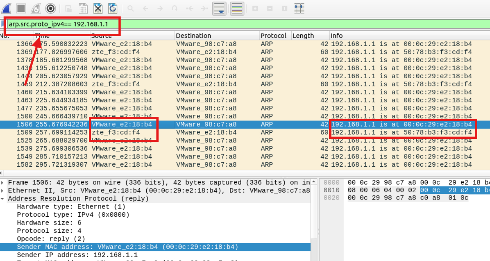
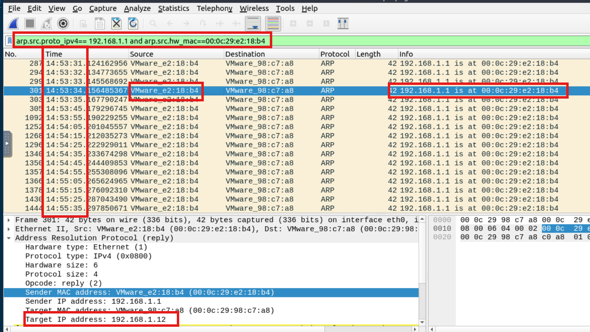
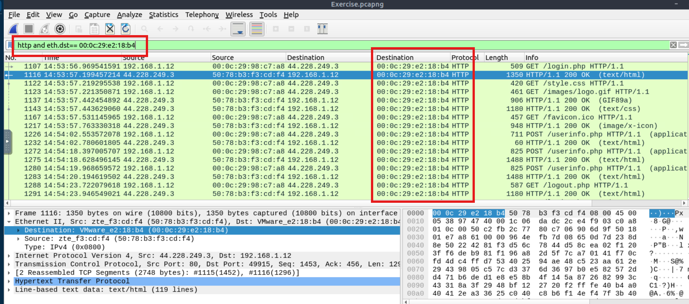
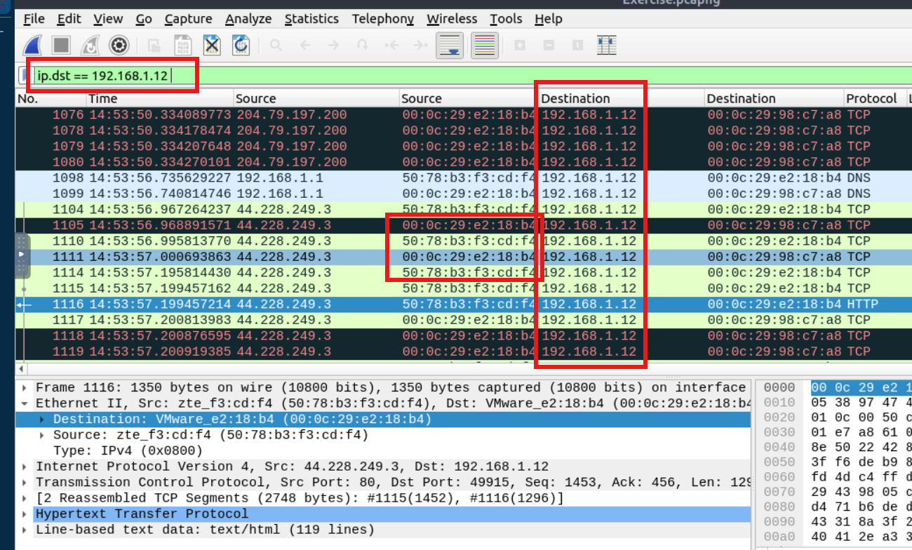
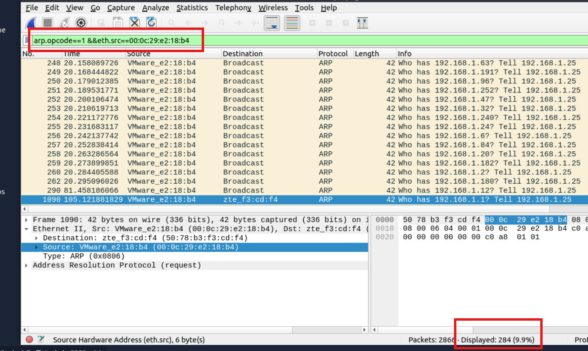
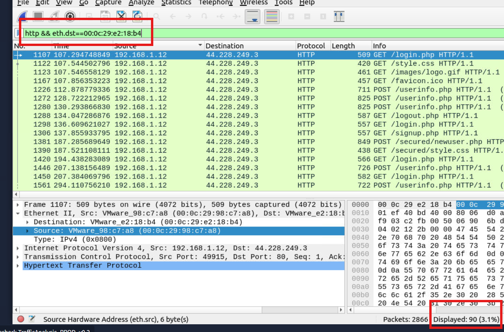
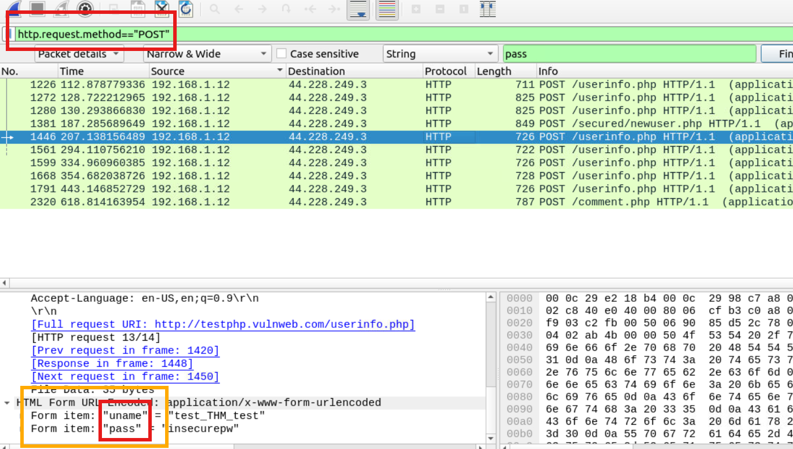
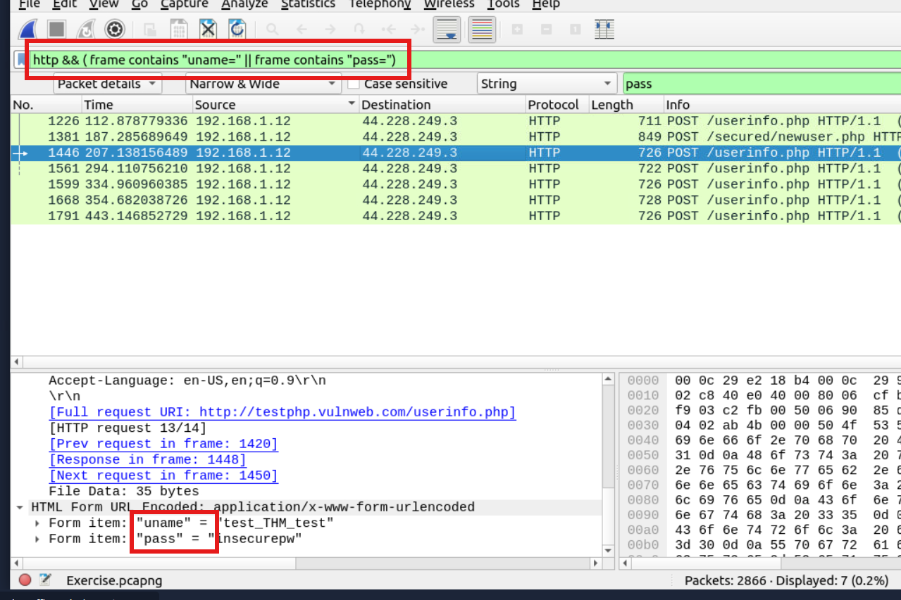

# Análisis de ARP Spoofing y posible ataque MITM mediante Wireshark

## Objetivo

En esta etapa se trabajó con el análisis de tráfico ARP mediante Wireshark, utilizando filtros de visualización para identificar posibles asociaciones incorrectas entre direcciones IP y direcciones MAC.

El objetivo principal fue investigar una posible actividad de ARP Spoofing (ARP Poisoning) y determinar si existían indicios de un ataque Man-in-the-Middle (MITM) en el que un dispositivo pudiera estar interceptando tráfico destinado a otro equipo de la red.

Para ello, se analizaron los anuncios ARP, las direcciones MAC de origen y destino, y el tráfico dirigido a la máquina víctima dentro de una captura PCAP.

---

# Análisis realizado

Para el ejercicio se tomó como referencia la dirección IP `192.168.1.1`, correspondiente al router según el contexto del laboratorio, y la dirección IP `192.168.1.12`, correspondiente a la máquina víctima.

Durante la investigación se identificaron las siguientes direcciones MAC relevantes:

* MAC del router aparente: `50:78:b3:f3:cd:f4`.
* MAC sospechosa: `00:0c:29:e2:18:b4`.
* Otra MAC observada: `00:0c:29:98:c7:a8`.

El análisis se realizó sobre una captura PCAP previamente obtenida, utilizando filtros de visualización para investigar las asociaciones ARP y el tráfico relacionado con la víctima.

# Evidencia

Las capturas incluidas en esta sección muestran los filtros utilizados durante la investigación y los resultados obtenidos al analizar el tráfico de red.

## 1. Identificación de múltiples MAC asociadas a una misma IP

**Filtro utilizado:**

```wireshark
arp.src.proto_ipv4 == 192.168.1.1
```

Este filtro permite visualizar los paquetes ARP en los que el emisor declara que su dirección IP es `192.168.1.1`.

En los resultados se observaron 2 direcciones MAC anunciando esa misma IP, entre ellas la MAC del router aparente y la MAC sospechosa.

Esta situación constituye un indicador de posible ARP Spoofing, ya que un dispositivo podría estar intentando asociar la IP del router con su propia dirección MAC.



## 2. Identificación de anuncios ARP relacionados con la víctima

**Filtro utilizado:**

```wireshark
arp.src.proto_ipv4 == 192.168.1.1 and arp.src.hw_mac == 00:0c:29:e2:18:b4
```

Este filtro permite identificar los paquetes ARP en los que la MAC sospechosa anuncia que la IP de origen es `192.168.1.1`.

Al inspeccionar los detalles de uno de los paquetes, se observó que el campo `Target IP address` contenía la dirección `192.168.1.12`, correspondiente a la máquina víctima.

Este hallazgo es compatible con un intento de influir en la asociación ARP utilizada por la víctima para comunicarse con el router.

El campo `Target IP address` identifica el destinatario declarado en el mensaje ARP, pero no demuestra por sí solo que la víctima haya aceptado la asociación anunciada.



## 3. Identificación de tráfico HTTP dirigido a la MAC sospechosa

**Filtro utilizado:**

```wireshark
http and eth.dst == 00:0c:29:e2:18:b4
```

Este filtro permite visualizar los paquetes reconocidos como HTTP cuya dirección MAC de destino Ethernet es `00:0c:29:e2:18:b4`.

En la captura se observaron paquetes HTTP con destino a la MAC investigada.

Este comportamiento, analizado junto con los anuncios ARP anteriores, refuerza la hipótesis de que el dispositivo sospechoso podría estar recibiendo tráfico de la red.

Sin embargo, este filtro no demuestra por sí solo que todo el tráfico HTTP de la víctima pase por dicho dispositivo ni que exista interceptación efectiva. Para confirmar esa hipótesis es necesario correlacionar las comunicaciones y verificar el punto en el que se capturaron los paquetes.



## 4. Análisis del tráfico dirigido a la máquina víctima

**Filtro utilizado:**

```wireshark
ip.dst == 192.168.1.12
```

Este filtro permite visualizar los paquetes IP cuya dirección de destino es `192.168.1.12`.

En los resultados se observaron paquetes dirigidos a la víctima con la dirección IP de origen `192.168.1.1`, pero asociados a diferentes direcciones MAC de origen.

Entre las asociaciones identificadas se encuentran:

* `192.168.1.1` con MAC de origen `50:78:b3:f3:cd:f4`.
* `192.168.1.1` con MAC de origen `00:0c:29:e2:18:b4`.

La presencia de una misma IP de origen con diferentes MAC constituye un indicador relevante cuando se investiga una posible suplantación ARP.

Al correlacionar estos paquetes con las evidencias anteriores, se obtiene un patrón compatible con un posible ARP Spoofing orientado a la máquina víctima.

 se observan paquetes dirigidos a la víctima con una misma IP de origen y diferentes direcciones MAC de origen.

# Conclusión

Durante el análisis de la captura PCAP se identificaron varios indicadores compatibles con un posible ataque ARP Spoofing.

La evidencia más relevante fue la detección de diferentes direcciones MAC asociadas a la IP del router, junto con anuncios ARP de la MAC sospechosa dirigidos a la máquina víctima.


La correlación de estos hallazgos permite establecer la hipótesis de que el dispositivo sospechoso podría estar intentando posicionarse en el camino de las comunicaciones de la víctima, en un escenario compatible con un posible ataque Man-in-the-Middle.

# Aprendizajes

* Identificación de asociaciones IP-MAC mediante filtros ARP.
* Detección de posibles conflictos en la resolución de direcciones dentro de una red local.
* Análisis de los campos `Sender IP address`, `Sender MAC address` y `Target IP address`.
* Correlación de direcciones IP y MAC para investigar posibles ataques de suplantación.
* Identificación de tráfico HTTP dirigido a una dirección MAC determinada.
* Uso combinado de filtros ARP, IP y HTTP para investigar actividad sospechosa.
* Diferenciación entre evidencias observadas, hipótesis de ataque y conclusiones confirmadas.
* Importancia de verificar el contexto de captura antes de atribuir un comportamiento a un atacante.

# Evidencias adjuntas

* Captura 1: múltiples direcciones MAC asociadas a la IP del router.
* Captura 2: anuncio ARP de la MAC sospechosa relacionado con la IP de la víctima.
* Captura 3: paquetes HTTP con destino Ethernet a la MAC sospechosa.
* Captura 4: tráfico dirigido a la víctima con diferentes MAC de origen para una misma IP de origen.


## 5. Ejercicios


**Pregunta 1:** ¿Cuál es el número de solicitudes ARP elaboradas por el atacante?

En primer lugar, podemos desglosar la pregunta en dos partes. La primera hace referencia a las **solicitudes ARP**, por lo que necesitamos identificar los paquetes cuyo código de operación sea `1`, correspondiente a las solicitudes ARP. Para ello, utilizamos el filtro `arp.opcode == 1`.

La segunda parte indica que las solicitudes deben haber sido elaboradas por el atacante. Como ya conocemos su dirección MAC (`00:0c:29:e2:18:b4`), podemos filtrar los paquetes cuya MAC de origen coincida con esa dirección mediante `eth.src == 00:0c:29:e2:18:b4`.

Al combinar ambas condiciones con el operador lógico `&&` (AND), obtenemos el siguiente filtro:

```wireshark
arp.opcode == 1 && eth.src == 00:0c:29:e2:18:b4
```

El resultado permite identificar las solicitudes ARP cuya MAC de origen coincide con la dirección MAC investigada. El contador de paquetes mostrados en Wireshark permite obtener la cantidad de coincidencias.



**Pregunta 2:** ¿Cuál es el número de paquetes HTTP que recibe el atacante?

Esta pregunta sigue una lógica similar a la anterior. Primero, identificamos los paquetes correspondientes al protocolo HTTP mediante el filtro `http`. Luego, debemos determinar cuáles tienen como destino la dirección MAC del atacante.

Para ello, utilizamos `eth.dst == 00:0c:29:e2:18:b4`, que permite identificar los paquetes cuya dirección MAC de destino coincide con la del atacante.

Al combinar ambas condiciones, obtenemos el siguiente filtro:

```wireshark
http && eth.dst == 00:0c:29:e2:18:b4
```

El resultado muestra los paquetes HTTP capturados cuya dirección MAC de destino coincide con la dirección investigada. El contador de paquetes mostrados permite conocer cuántos cumplen estas condiciones.



**Pregunta 3:** ¿Cuál es el número de entradas de nombres de usuario y contraseñas detectadas?

En primer lugar, buscamos las solicitudes HTTP que utilizan el método `POST`, ya que este método suele emplearse para enviar datos de formularios al servidor. Para identificarlas, utilizamos el siguiente filtro:

```wireshark
http.request.method == "POST"
```

Este filtro reduce la cantidad de paquetes mostrados y permite localizar solicitudes que, en el campo de información (`Info`), hacen referencia a `userinfo.php`.

Al inspeccionar los detalles de estas solicitudes, encontramos campos denominados `uname` y `pass`, que corresponden a posibles campos de nombre de usuario y contraseña. A partir de esta observación, podemos buscar paquetes que contengan esos términos mediante el siguiente filtro:

```wireshark
http && (frame contains "uname=" || frame contains "pass=")
```


